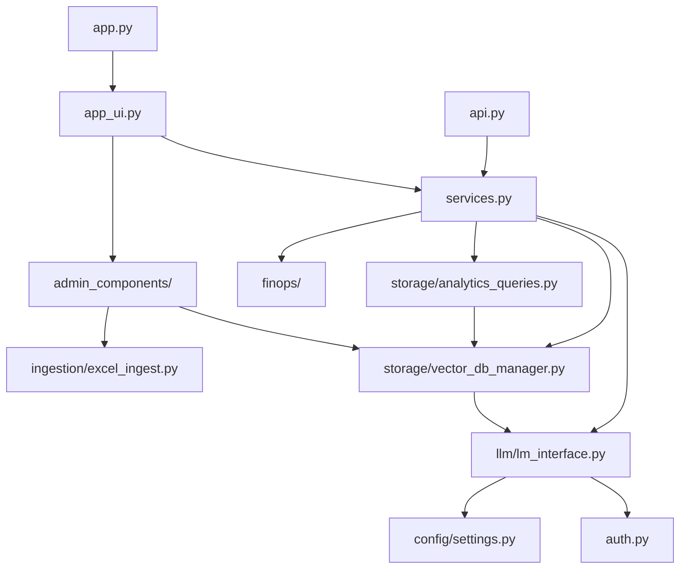

# AI Insights V2 - Project Structure

Complete directory structure and file organization for the AI Usage Insights platform.

## 📁 Root Directory Files

```
AiInsights_V2/
├── app.py                              # Streamlit app entry point
├── app_ui.py                           # Main UI components and layouts
├── api.py                              # FastAPI REST API server
├── auth.py                             # Enterprise JWT authentication
├── models.py                           # Pydantic data models
├── services.py                         # Business logic and LLM services
├── requirements.txt                    # Python dependencies
├── .env.example                        # Environment configuration template
├── .env                                # Environment configuration (create this)
├── finops_config.json                  # FinOps decision factors config
├── AI_Insights_API.postman_collection.json  # API test collection
└── README.md                           # Main setup guide
```

## 📂 Core Application Directories

### `/admin` - Admin Utilities
```
admin/
├── __init__.py
└── admin_utils.py          # Admin helper functions
```

### `/admin_components` - Admin UI Components  
```
admin_components/
├── __init__.py
├── dashboard_tab.py        # Dashboard UI component
├── bulk_import_tab.py      # Bulk import UI component
└── manual_add_tab.py       # Manual add UI component
```

### `/config` - Configuration Management
```
config/
├── __init__.py
└── settings.py             # Settings loader using pydantic_settings
```

### `/llm` - LLM Interface Layer
```
llm/
├── __init__.py
├── lm_interface.py         # LLM abstraction layer (Ollama/Azure/Gemini)
└── prompts.py              # System prompts for different use cases
```

### `/storage` - Data Storage Layer
```
storage/
├── __init__.py
├── vector_db_manager.py    # ChromaDB manager with analytics methods
└── analytics_queries.py    # Analytics utility functions (NEW)
```

### `/platform_logic` - Platform Recommendations
```
platform_logic/
├── __init__.py
└── platform_recommender.py  # Platform recommendation engine
```

### `/finops` - FinOps Integration
```
finops/
├── __init__.py
├── finops_config.py        # FinOps configuration loader
├── finops_metrics.py       # FinOps metrics calculations
└── finops_queries.py       # FinOps-specific queries
```

### `/ingestion` - Data Ingestion
```
ingestion/
├── __init__.py
└── excel_ingest.py         # Excel file ingestion logic
```

## 📚 Organized Directories

### `/docs` - Documentation
```
docs/
├── README.md               # Documentation index
├── ARCHITECTURE.md         # System architecture documentation
├── ENTERPRISE_SETUP.md     # Enterprise deployment guide
└── CHANGELOG_ENTERPRISE.md # Version history
```

**Purpose:** All architecture, design, and setup documentation.

### `/tests` - Test Scripts
```
tests/
├── README.md                         # Test suite documentation
├── test_analytics_queries.py         # Analytics tests (NEW)
├── test_auth.py                      # Authentication tests
├── test_llm.py                       # LLM interface tests
├── test_vectordb.py                  # VectorDB tests
├── test_gemini.py                    # Gemini integration tests
├── test_data_generator.py            # Test data generator (NEW)
└── comprehensive_test_queries.py     # Full test suite (NEW)
```

**Purpose:** All test scripts and test data generation.

### `/scripts` - Utility Scripts
```
scripts/
├── README.md                   # Scripts documentation
├── check_config.py             # Configuration validator
├── verify_all.py               # System validation
├── debug_llm_connection.py     # LLM debugging
├── investigate_url_pattern.py  # URL pattern investigation
└── purge_vector_db.py          # Database cleanup utility
```

**Purpose:** Maintenance, debugging, and utility scripts.

### `/data` - Data Files
```
data/
└── BankWide AI Project Tracker.xlsx  # Sample data file
```

### `/assets` - Static Assets
```
assets/
└── natwest_logo.png         # NatWest logo for UI
```

### `/chroma_store` - ChromaDB Storage
```
chroma_store/
└── [ChromaDB files]         # Vector database storage (auto-generated)
```

### `/.streamlit` - Streamlit Configuration
```
.streamlit/
└── config.toml              # Streamlit app configuration
```

## 🎯 File Purpose Reference

### Entry Points
| File | Purpose | Command |
|------|---------|---------|
| app.py | Streamlit UI | `streamlit run app.py` |
| api.py | REST API | `uvicorn api:app --reload` |

### Core Modules
| File | Purpose |
|------|---------|
| app_ui.py | UI components and page rendering |
| auth.py | JWT authentication for enterprise |
| models.py | Pydantic data models |
| services.py | Business logic and LLM orchestration |

### Configuration
| File | Purpose |
|------|---------|
| .env | Environment variables (you create this) |
| .env.example | Environment template |
| finops_config.json | FinOps decision factors |
| config/settings.py | Settings loader |

### Data & Storage
| File/Dir | Purpose |
|----------|---------|
| storage/vector_db_manager.py | ChromaDB interface |
| storage/analytics_queries.py | Analytics functions |
| chroma_store/ | Vector DB storage |
| data/ | Input data files |

## 🔍 Module Dependencies



## 📋 Quick Navigation

### For Development
- **Start here:** [README.md](../README.md)
- **Architecture:** [docs/ARCHITECTURE.md](docs/ARCHITECTURE.md)
- **Tests:** [tests/README.md](tests/README.md)

### For Deployment
- **Setup:** [README.md](../README.md)
- **Enterprise:** [docs/ENTERPRISE_SETUP.md](docs/ENTERPRISE_SETUP.md)
- **Scripts:** [scripts/README.md](scripts/README.md)

### For Testing
- **Test Suite:** [tests/README.md](tests/README.md)
- **Utilities:** [scripts/README.md](scripts/README.md)

## 📌 Important Notes

1. **Never commit `.env`** - Contains sensitive credentials
2. **`chroma_store/`** - Auto-generated, can be deleted to reset DB
3. **`venv/`** - Python virtual environment, not committed to git
4. **`__pycache__/`** - Python cache, auto-generated

## 🚀 Getting Started

1. Follow [README.md](../README.md) for initial setup
2. Run validation: `python3 scripts/verify_all.py`
3. Run tests: `python3 tests/test_analytics_queries.py`
4. Start app: `streamlit run app.py`

## 📊 Statistics

- **Total Directories:** 18
- **Core Python Files:** ~30
- **Test Scripts:** 7
- **Utility Scripts:** 5
- **Documentation Files:** 4
- **Lines of Code:** ~10,000+
